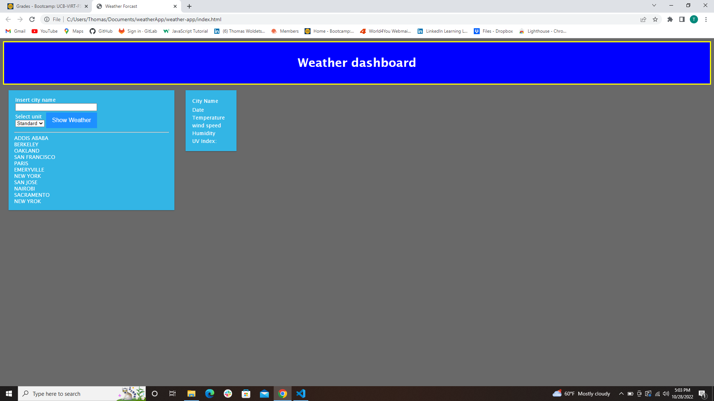
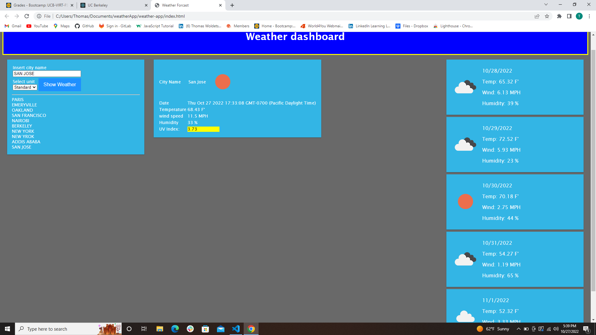
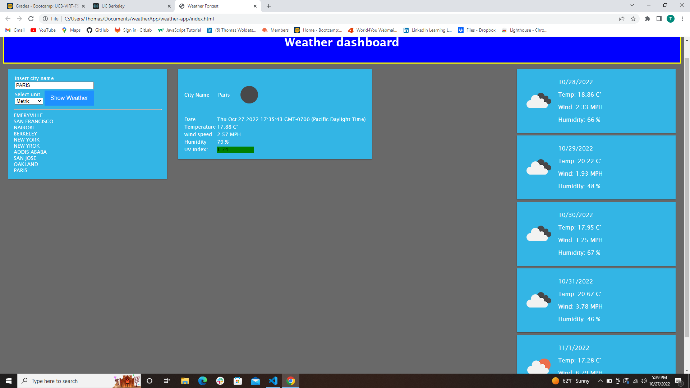

# Weather Dashboard

## screenshots

## Live link

[Live link](https://formulaxyz.github.io/weather-app/)

## Description

Developers are often tasked with retrieving data from another application's API and using it in the context of their own. I built
this weather dashboard that will run in the browser and feature dynamically updated HTML and CSS.Third-party APIs allow developers
to access their data and functionality by making requests with specific parameters to a URL.I used [OpenWeather One Call API](https://openweathermap.org/api/one-call-api)
to retrieve weather data for cities.

## Uses

dependes on where the user located, the app gives an option to show in standard(F) or metric(c) system
When travelers want to see the weather outlook for multiple cities,so that they can plan a trip accordingly
this weather dashboard with form inputs.when the user search for a city,then the user presented with current and future conditions
for that city and that city is added to the search history.when the user view current weather conditions for that city.then the
user presented with the city name, the date, an icon representation of weather conditions, the temperature, the humidity, the wind
speed, and the UV index
when the user view the UV index
the the user presented with a color that indicates whether the conditions are favorable, moderate, or severe
when the user view future weather conditions for that city
then the user presented with a 5-day forecast that displays the date, an icon representation of weather conditions, the temperature,
the wind speed, and the humidity
when the user click on a city in the search history
then the usewr again presented with current and future conditions for that city
